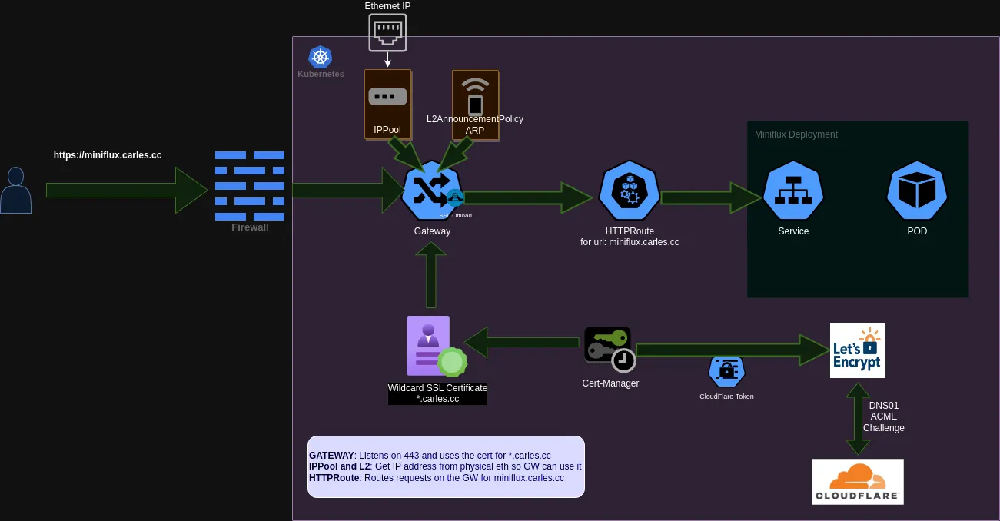

# flux-cluster
Welcome to my **really** highly opinionated Repo for my GitOps home-lab. In this repo I install a basic Vanilla [Kubernetes](https://kubernetes.io/docs/home/) and I use [Flux](https://fluxcd.io/flux/) to manage its state.

## **Table of Content:**
- [Introduction](#introduction)
- [Features](#features)
- [Pre-start Checklist](#pre-start)
- [Machine Preparation](#machine-prep)
- [Kubernetes and Cillium](#k8s)
- [Flux Installation](#flux)
- [Gateway API and SSL](#gateway)
- [Storage](#storage)

## 👋 Introduction <a id="introduction"></a>
My personal Goal with this project is to have an easy and elegant way to manage applications that I want to run in my kubernetes home-lab, while at the same time use it to keep learning the intrinsicacies of Kubernetes and GitOps. That is why I took some choices like for example installing Vanilla Kubernetes by hand. You won't find here *Ansible* playbooks or other automatisms to install Kubernetes, Flux and its tools. For now I choose to install everything by hand and learn and interiorize during the process. It is my goal to take out any abstraction on top of the basic Kubernetes components while at the same time enjoying a useful GitOps installation.

From a technical perspective I am interested in getting as much as possible out of [Cilium](https://cilium.io/) and [eBPF](https://ebpf.io/). I will replace *Kube-proxy*, the *ingress controller* and [MetalLB](https://metallb.universe.tf/) with [Cilium](https://cilium.io/) and [Gateway API](https://gateway-api.sigs.k8s.io/).

## ✨ Features <a id="features"></a>

- Documented **manual** Installation of Kubernetes v1.29 mono-node cluster in Debian 12 *BookWorm*
- Opinionated implementation of Flux with [strong community support](https://github.com/onedr0p/flux-cluster-template#-support)
- Encrypted secrets thanks to [SOPS](https://github.com/getsops/sops)
- SSL certificates thanks to [Cloudflare](https://cloudflare.com), [cert-manager](https://cert-manager.io) and [let'sencrypt](https://letsencrypt.org/)
- Next-gen networking thanks to [Cilium](https://cilium.io/) and [Gateway API](https://gateway-api.sigs.k8s.io/)
- A [Renovate](https://www.mend.io/renovate)-ready repository

... and more!

## 📝 Pre-start checklist <a id="pre-start"></a>

Before getting started everything below must be taken into consideration, you must...

- [ ] run the cluster on bare metal machines or VMs within your home network &mdash; **this is NOT designed for cloud environments**.
- [ ] have Debian 12 freshly installed on 1 or more AMD64/ARM64 bare metal machines or VMs. Each machine will be either a **control node** or a **worker node** in your cluster.
- [ ] give your nodes unrestricted internet access &mdash; **air-gapped environments won't work**.
- [ ] have a domain you can manage on Cloudflare.
- [ ] be willing to commit encrypted secrets to a public GitHub repository.
- [ ] have a DNS server that supports split DNS (e.g. [AdGuardHome](https://github.com/AdguardTeam/AdGuardHome) or<Down> Pi-Hole) deployed somewhere outside your cluster **ON** your home network.

## 💻 Machine Preparation <a id="machine-prep"></a>

### System Requirements

According to the Official Documentation the [requirements](https://kubernetes.io/docs/setup/production-environment/tools/kubeadm/create-cluster-kubeadm/#before-you-begin) for kubernetes are just 2 Cores and 2 Gb of Ram to install a Control-Plane node, but obviously only with this we would be leaving little room left for our apps.

📍 For my home-lab I will only be installing one Control-Plane node, so to run apps in it I will remove the Kubernetes *Taint* that block control-plane nodes from running normal Pods.

📍 I Choose Debian Stable because IMO is the best hassle-free, community-driven and stability and security focused distribution. [Talos](https://www.talos.dev/) would be another great option.

### 🌀 Debian Installation

Perform a basic server installation **without Swap partition or SwapFile**, Kubernetes and Swap aren't friends yet.

After Debian is installed:

1. [Post install] Enable sudo for your non-root user

    ```sh
    su -
    apt update
    apt install -y sudo
    usermod -aG sudo ${username}
    echo "${username} ALL=(ALL) NOPASSWD:ALL" | tee /etc/sudoers.d/${username}
    exit
    newgrp sudo
    sudo apt update
    ```

2. [Post install] Add SSH keys (or use `ssh-copy-id` on the client that is connecting)

    📍 _First make sure your ssh keys are up-to-date and added to your github account as [instructed](https://docs.github.com/en/authentication/connecting-to-github-with-ssh/adding-a-new-ssh-key-to-your-github-account)._

    ```sh
    mkdir -m 700 ~/.ssh
    sudo apt install -y curl
    curl https://github.com/${github_username}.keys > ~/.ssh/authorized_keys
    chmod 600 ~/.ssh/authorized_keys
    ```

3. [Containerd] Configure Kernel modules and pre-requisites for containerd

    ```sh
    cat <<EOF | sudo tee /etc/modules-load.d/containerd.conf
    overlay
    br_netfilter
    EOF
    ```

    ```sh
    sudo modprobe overlay
    sudo modprobe br_netfilter
    ```

    ```sh
    cat <<EOF | sudo tee /etc/sysctl.d/99-kubernetes-cri.conf
    net.bridge.bridge-nf-call-iptables = 1
    net.ipv4.ip_forward = 1
    net.bridge.bridge-nf-call-ip6tables = 1
    EOF
    ```

    ```sh
    sudo sysctl --system
    ```

4. [Containerd] Install Containerd

    ```sh
    sudo apt-get update
    sudo apt-get install containerd
    ```

5. [Containerd] Set the configuration file for Containerd:

    ```sh
    sudo mkdir -p /etc/containerd
    containerd config default | sudo tee /etc/containerd/config.toml
    ```

6. [Containerd] Set cgroup driver to systemd:


    ```sh
    sudo vim /etc/containerd/config.toml
    ```

    ```sh
    [plugins."io.containerd.grpc.v1.cri".containerd.runtimes]
    [plugins."io.containerd.grpc.v1.cri".containerd.runtimes.runc]
          runtime_type = "io.containerd.runc.v2"
          runtime_engine = ""
          runtime_root = ""
          privileged_without_host_devices = false
          base_runtime_spec = ""

    [plugins."io.containerd.grpc.v1.cri".containerd.runtimes.runc.options]
          SystemdCgroup = true
    ```

Edit the containerd configuration file and ensure that the option SystemdCgroup is set to "true".

After that restart containerd and ensure everything is up and running properly.


    sudo systemctl restart containerd.service
    sudo systemctl status containerd.service


## 🔧 Install Kubernetes with KubeAdm and without KubeProxy <a id="k8s"></a>

When we already have a CRI installed(containerd) and starting properly using systemd it is the time to install K8s, for this guide we want to provision a Kubernetes cluster without *kube-proxy*, and to use *Cilium* to fully replace it. For simplicity, we will use kubeadm to bootstrap the cluster. For help with installing *kubeadm* and for more provisioning options please refer to [the official Kubeadm documentation](https://kubernetes.io/docs/setup/production-environment/tools/kubeadm/create-cluster-kubeadm/).

Then, after installing kubeadm, kubectl and kubelet and perform the **kubeadm init** we can ensure everything is *almost* up and ready in our cluster:

```sh
>  sudo kubeadm init --skip-phases=addon/kube-proxy
```
Notice that we are skipping the installation of kube-proxy, which isn't a default option. We do this because we want to use *Cilium* to take over the role of the kube-proxy. This is [requisite](https://docs.cilium.io/en/stable/network/servicemesh/gateway-api/gateway-api/#what-is-gateway-api) of *Cilium* to be able to use its implementation of the [Gateway API](https://docs.cilium.io/en/stable/network/servicemesh/ingress-to-gateway/ingress-to-gateway/#benefits-of-the-gateway-api).

```sh
~ on  main [!?] 
❯ k get nodes
NAME       STATUS   ROLES           AGE   VERSION
bacterio   UnReady    control-plane   5d    v1.29.3
```
In order to get a Ready state, we still have to install our Pod Network Add-on or **CNI**.

### Install Gateway API

Before installing the *Container Network Interface* we will install the necessary *CRD*s for the Gateway API to work:

```bash
$ kubectl apply -f https://raw.githubusercontent.com/kubernetes-sigs/gateway-api/v1.0.0/config/crd/standard/gateway.networking.k8s.io_gatewayclasses.yaml
$ kubectl apply -f https://raw.githubusercontent.com/kubernetes-sigs/gateway-api/v1.0.0/config/crd/standard/gateway.networking.k8s.io_gateways.yaml
$ kubectl apply -f https://raw.githubusercontent.com/kubernetes-sigs/gateway-api/v1.0.0/config/crd/standard/gateway.networking.k8s.io_httproutes.yaml
$ kubectl apply -f https://raw.githubusercontent.com/kubernetes-sigs/gateway-api/v1.0.0/config/crd/standard/gateway.networking.k8s.io_referencegrants.yaml
$ kubectl apply -f https://raw.githubusercontent.com/kubernetes-sigs/gateway-api/v1.0.0/config/crd/experimental/gateway.networking.k8s.io_grpcroutes.yaml
$ kubectl apply -f https://raw.githubusercontent.com/kubernetes-sigs/gateway-api/v1.0.0/config/crd/experimental/gateway.networking.k8s.io_tlsroutes.yaml
``` 

### 🌐 Installing the Container Network Interface (CNI) add-on

In this guide we will install *Cilium* using *Helm*, as described in the [Cilium Documentation](https://docs.cilium.io/en/stable/network/kubernetes/kubeproxy-free/#kubeproxy-free) for *Kube-Proxy* free kubernetes.

1. First we add the *Cilium* Helm repository:
```bash
helm repo add cilium https://helm.cilium.io/
```

2. We install *Cilium* setting up the right env vars:
```bash
API_SERVER_IP=<your_api_server_ip>
# Kubeadm default is 6443
API_SERVER_PORT=<your_api_server_port>
helm install cilium cilium/cilium --version 1.15.1 \
    --set operator-replicas=1 #We are installing on a mono-node so this is necessary
    --namespace kube-system \
    --set kubeProxyReplacement=strict \
    --set gatewayAPI.ebabled=true \
    --set k8sServiceHost=${API_SERVER_IP} \
    --set k8sServicePort=${API_SERVER_PORT} \
    --set l2announcements.enabled=true \
    --set externalIPs.enabled=true \
    --set hubble.ui.enabled=true \
    --set hubble.relay.enabled=true \
    --set k8s.requireIPv4PodCIDR=true \
    --set annotateK8sNode=true
```

This will install Cilium as a CNI plugin with the eBPF kube-proxy replacement to implement handling of Kubernetes services of type ClusterIP, NodePort, LoadBalancer and services with externalIPs. As well, the eBPF kube-proxy replacement also supports hostPort for containers such that using portmap is not necessary anymore.

Finally, as a last step, verify that Cilium has come up correctly on all nodes and is ready to operate:

```bash
$ kubectl -n kube-system get pods -l k8s-app=cilium
NAME                READY     STATUS    RESTARTS   AGE
cilium-fmh8d        1/1       Running   0          10m
```

Note, in above Helm configuration, the **kubeProxyReplacement** has been set to **strict** mode. This means that the Cilium agent will bail out in case the underlying Linux kernel support is missing.

By default, Helm sets **kubeProxyReplacement=false**, which only enables per-packet in-cluster load-balancing of ClusterIP services.

Cilium’s eBPF kube-proxy replacement is supported in direct routing as well as in tunneling mode.

And after that the Cluster will become Ready.

```sh
~ on  main [!?] 
❯ k get nodes
NAME       STATUS   ROLES           AGE   VERSION
bacterio   Ready    control-plane   5d    v1.29.3
```

#### Validate the Setup

After deploying Cilium with above Quick-Start guide, we can first validate that the Cilium agent is running in the desired mode:

```bash
$ kubectl -n kube-system exec ds/cilium -- cilium-dbg status | grep KubeProxyReplacement
KubeProxyReplacement:   True        [eth0 (Direct Routing), eth1]
```

#### Hubble UI

*Cilium* provides *Hubble* for observability, it can both be used using the *Hubble CLI* or the *UI*, in order to access the *Hubble UI* you just need to execute:

```bash
cilium hubble ui
```

### Untaint the Cluster to be able to Run Pods

Finally, we untaint the *Control-Plane* node to allow it to run workloads and test that it can in fact run a *Pod*.

```sh
kubectl taint nodes bacterio node-role.kubernetes.io/control-plane:NoSchedule-
```

```sh
kubectl run testpod --image=nginx
kubectl get pods
```

## 🤖 Installing Flux <a id="flux"></a>

[Flux](https://fluxcd.io/) is a set of continuous and progressive delivery solutions for Kubernetes that are open and extensible. In a more plain language Flux is a tool for keeping Kubernetes clusters in sync with sources of configuration (like Git repositories), that way we can use GIT as source of truth and use it to interact with our Cluster.

### Install the Flux CLI

The **Flux** command-line interface (CLI) is used to bootstrap and interact with Flux.

```sh
curl -s https://fluxcd.io/install.sh | sudo bash
```

And [here](https://fluxcd.io/flux/cmd/flux_completion_bash/) you can find instructions to add *bash* autocompletion features to the shell.

### Export your credentials

Export your GitHub personal access token and username:

```sh
export GITHUB_TOKEN=<your-token>
export GITHUB_USER=<your-username>
```

The kind of *GITHUB_TOKEN* in use here is **PAT**(Personal Access Token)

### Check your Kubernetes Cluster

We can use the Flux CLI to run a pre-flight check on our Cluster and see if we fulfill all the basic requirements to install **Flux**.

```sh
flux check --pre
```
Which should produce an output like:
```sh
► checking prerequisites
✔ kubernetes 1.29.2 >=1.25.0
✔ prerequisites checks passed
```

### Installing Flux onto the Cluster

For information on how to bootstrap using a GitHub org, Gitlab and other git providers, see [Bootstraping](https://fluxcd.io/flux/installation/bootstrap/).

```sh
flux bootstrap github \
  --owner=$GITHUB_USER \
  --repository=home-cluster \
  --branch=main \
  --path=./clusters/home-cluster \
  --personal
```

The output is similar to:

```sh
► connecting to github.com
✔ repository created
✔ repository cloned
✚ generating manifests
✔ components manifests pushed
► installing components in flux-system namespace
deployment "source-controller" successfully rolled out
deployment "kustomize-controller" successfully rolled out
deployment "helm-controller" successfully rolled out
deployment "notification-controller" successfully rolled out
✔ install completed
► configuring deploy key
✔ deploy key configured
► generating sync manifests
✔ sync manifests pushed
► applying sync manifests
◎ waiting for cluster sync
✔ bootstrap finished
```
The bootstrap command above does the following:

- Creates a git repository *home-cluster* on your GitHub account.
- Adds Flux component manifests to the repository.
- Deploys Flux Components to your Kubernetes Cluster. 
- Configures Flux components to track the path /clusters/home-cluster/ in the repository

By default **Flux** installs 4 components: **source-controller**, **kustomize-controller**, **helm-controller** and **notification-controller**, you can check that all of them are properly running by looking in the *flux-system* namespace.

```sh
❯ k get all -n flux-system
NAME                                          READY   STATUS    RESTARTS   AGE
pod/helm-controller-5f964c6579-z44r9          1/1     Running   0          6d18h
pod/kustomize-controller-9c588946c-6h9fd      1/1     Running   0          6d18h
pod/notification-controller-76dc5d768-z47jw   1/1     Running   0          6d18h
pod/source-controller-6c49485888-gl6dz        1/1     Running   0          6d18h

NAME                              TYPE        CLUSTER-IP      EXTERNAL-IP   PORT(S)   AGE
service/notification-controller   ClusterIP   10.97.135.57    <none>        80/TCP    6d18h
service/source-controller         ClusterIP   10.97.126.173   <none>        80/TCP    6d18h
service/webhook-receiver          ClusterIP   10.107.72.214   <none>        80/TCP    6d18h

NAME                                      READY   UP-TO-DATE   AVAILABLE   AGE
deployment.apps/helm-controller           1/1     1            1           6d18h
deployment.apps/kustomize-controller      1/1     1            1           6d18h
deployment.apps/notification-controller   1/1     1            1           6d18h
deployment.apps/source-controller         1/1     1            1           6d18h

NAME                                                DESIRED   CURRENT   READY   AGE
replicaset.apps/helm-controller-5f964c6579          1         1         1       6d18h
replicaset.apps/kustomize-controller-9c588946c      1         1         1       6d18h
replicaset.apps/notification-controller-76dc5d768   1         1         1       6d18h
replicaset.apps/source-controller-6c49485888        1         1         1       6d18h
```

And now, to move to the next steps, we can just clone the **GIT** repository we just created to start deploying apps and configuration onto our Cluster.

```sh
git clone git@github.com:cc250080/home-cluster.git
cd home-cluster
```

### Flux Structure

To structure the repository we use a mono-repo approach, the flux documentation [Ways of structuring your repositories](https://fluxcd.io/flux/guides/repository-structure/) is very helpful here specially the following example which I took as a [baseline](https://github.com/fluxcd/flux2-kustomize-helm-example).

```bash
├── apps #The applications are installed in this folders
│   └── miniflux
│       ├── kustomization.yaml
│       ├── miniflux-httproute.yaml
│       └── miniflux.yaml
├── flux-system # Flux components
│   ├── gotk-components.yaml
│   ├── gotk-sync.yaml
│   └── kustomization.yaml
└── infrastructure # This is executed before apps, here the yamls are for controllers, infrastructure and sources like Helm Repositories
    ├── cert-manager
    │   ├── certificate-carlescc.yaml
    │   ├── cert-manager.crds.yaml
    │   ├── cert-manager.yaml
    │   ├── cloudflare-api-token-secret-encrypted.yaml
    │   ├── clusterIssuer.yaml
    │   ├── kustomization.yaml
    │   └── ns-cert-manager.yaml
    ├── gateway-api
    │   ├── bacterio-gw.yaml
    │   ├── ippool-l2.yaml
    │   └── kustomization.yaml
    └── sources
```

### Securing Kubernetes Secrets with Sops

In the past, I loaded kubernetes secrets by hand with kubectl apply and kept them out of any shared storage, including git repositories. However, in my quest to follow the gitops way, I wanted a better option with much less manual work. My goal is to build a kubernetes deployment that could be redeployed from the git repository at a moment’s notice with the least amount of work required.

In order to store secrets safely in a public or private Git repository, we will use Mozilla’s [SOPS](https://github.com/mozilla/sops) CLI to encrypt Kubernetes secrets with Age, OpenPGP, AWS KMS, GCP KMS or Azure Key Vault.

In my case I will use age:

```bash
 sudo apt install age
 curl -LO https://github.com/getsops/sops/releases/download/v3.8.1/sops-v3.8.1.linux.amd64
 sudo mv sops-v3.8.1.linux.amd64 /usr/local/bin/sops
 sudo chmod +x /usr/local/bin/sops
```
#### Verify checksums file signature

```bash
# Download the checksums file, certificate and signature
curl -LO https://github.com/getsops/sops/releases/download/v3.8.1/sops-v3.8.1.checksums.txt
curl -LO https://github.com/getsops/sops/releases/download/v3.8.1/sops-v3.8.1.checksums.pem
curl -LO https://github.com/getsops/sops/releases/download/v3.8.1/sops-v3.8.1.checksums.sig

# Verify the checksums file
cosign verify-blob sops-v3.8.1.checksums.txt \
  --certificate sops-v3.8.1.checksums.pem \
  --signature sops-v3.8.1.checksums.sig \
  --certificate-identity-regexp=https://github.com/getsops \
  --certificate-oidc-issuer=https://token.actions.githubusercontent.com
```

## Gateway API and SSL <a id="gateway"></a>



## Storage: Kubernetes NFS CSI Driver <a id="storage"></a>

The NFS CSI Driver allows a Kubernetes cluster to access NFS servers on Linux. The driver is installed in the Kubernetes cluster and requires existing and configured NFS servers.

The status of the project is GA, meaning it is in General Availability and should be considered to be stable for production use.

